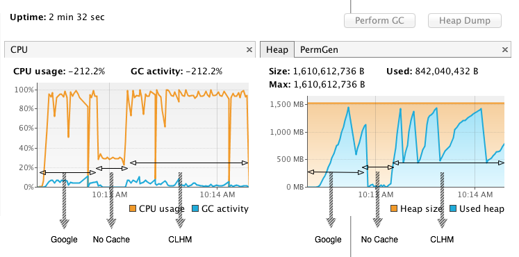

## Synopsis

Just a basic investigation into using the google guava library.  Initial thoughts were to look
at the cache to simply wrap the call to Class.getAnnotations which is sub-optimal and can deadlock in
java 6/7, due to http://bugs.sun.com/view_bug.do?bug_id=7122142.

Initial investigation showed up an interesting finding, add a LoadingCache seemed to have negative effect (i.e. slower).

```java
    cache = CacheBuilder.newBuilder()
                   .maximumSize(1000)
                   .expireAfterWrite(10, TimeUnit.SECONDS)
                   .concurrencyLevel(64)
                   .build(new CacheLoader<Class, Annotation[]>() {
                       @Override
                       public Annotation[] load(Class key) throws Exception {
                           return key.getAnnotations();
                       }
                   });
```

Closer inspection and analysis of the use case, it was seen/found that:

a Large number of consecutive cache hits, with no writes; would not be most appropriate use
for the Cache Builder.  The cache builder records access for the get, which adds an entry to a recencyQueue.  As a
result this uses a large amount of memory, that causes gc:


The benchmark also doesn't really simulate what would be a live situation.  You wouldn't ever probably get 1 million
cache reads on the same cache item in succession (for each thread, it is highly unrealistic);
without a write occurring (the recency queue is flushed when a write occurs in the segment of the hash associated with
the recency queue.  So it's unrealistic that you'd get such heavy number of gets.

However, it's interesting to see the overhead of the Cache, and is something to consider when using as a cache for things.

### Benchmark Results

The class (RunCachingTest) in the root package, runs the benchmark

jvm runtime options: -Xmx512m -Xms512m -Xmn128m -XX:-UseBiasedLocking

The benchmark basically does 1 million .get() hits (for eache thread that is running - unrealistic yes, it's just a
throughput test to see the effects of caching, and if there's anything to take into consideration - i.e. in this
case memory).  The benchmark is run with 1,2,4,8,16,32,64 threads.  The first benchmark runs the CacheBuilder scenario,
the second hits the Class.getAnnotations directly.

The benchmark outputs the amount of gc:


#### CacheBuilder

```java
public class CachingAnnotationReader implements AnnotationReader {

    private final LoadingCache<Class,Annotation[]> cache;

    public CachingAnnotationReader()  {
        cache = CacheBuilder.newBuilder()
                .maximumSize(1000)
                .expireAfterWrite(10, TimeUnit.SECONDS)
                .concurrencyLevel(64)
                .build(new CacheLoader<Class, Annotation[]>() {
                    @Override
                    public Annotation[] load(Class key) throws Exception {
                        return key.getAnnotations();
                    }
                });

    }

    @Override
    public Annotation[] getAnnotations(final Class clazz) {
//        cache.stats();  // this call reduces the recency queue
        return cache.getUnchecked(clazz);
    }

    public void close() {
        cache.cleanUp();
    }
}
```

The GC/Heap Profile for the above is (the numbers are mb):


```
Young Space in mb:
(min:0/max:101)
                 :                                                        |
                 : ||   |       |   |  |      || |              |         |   |||||||||||
                 : |||  |       |   |  |   |  || | |      ||||||||||      | |||||||||||||          |
                 :||||||||||||||||||||||||||||||||||||||||||||||||||||||||||||||||||||||||||||||||||
                 :   4   6   0   0   0   0   0   8   0   0   6   4   0   0   6   9   8   8   0   0
                 :   5                           6           0   2           2   4   0
                 :

Survivor Space in mb:
(min:0/max:12)
                    :  ||||||||||||| |||||||||| || |||||||          ||||||                  |||||||
                    :  ||||||||||||| ||||||||||||| |||||||          ||||||                  |||||||
                    :  ||||||||||||| |||||||||||||||||||||          ||||||                  |||||||
                    :||||||||||||||||||||||||||||||||||||||||||||||||||||||||||||||||||||||||||||||||||
                    :   1   1   1   0   1   1   1   1   1   0   0   1   1   0   0   0   0   1   1   0
                    :   2   2   2       2   2   2   2   2           2   2                   2   2

Old Space in mb:
(min:0/max:384)
               :                                         |||||
               :           ||||                   ||||||||||||    |||||||||||||||||||||    |||||||
               :        |||||||    |||||||||    ||||||||||||||||||||||||||||||||||||||||||||||||||
               :||||||||||||||||||||||||||||||||||||||||||||||||||||||||||||||||||||||||||||||||||
               :   8   1   2   1   1   2   2   1   3   3   3   1   3   2   3   3   3   1   3   2
               :       0   9       7   3   3   2   2   5   8   3   1   8   8   8   8   3   1   8
               :       0   4       1   5   5   7   6   0   4   3   4   5   0   3   3   4   2   7

Perm Space in mb:
(min:7/max:7)
                :||||||||||||||||||||||||||||||||||||||||||||||||||||||||||||||||||||||||||||||||||
                :   7   7   7   7   7   7   7   7   7   7   7   7   7   7   7   7   7   7   7   7
```

#### clazz.getAnnotations()

```java
public class BasicAnnotationReader implements AnnotationReader {

    @Override
    public Annotation[] getAnnotations(Class clazz) {
        return clazz.getAnnotations();
    }

    public void close(){}
}
```

The GC/Heap Profile for the above is (the numbers are mb):

```
Young Space in mb:
(min:0/max:102)
                 :        |
                 : |      |         | ||
                 : | | | ||| | | | |||||
                 :|||||||||||||||||||||||
                 :   6   5   5   5   3
                 :   2   1   4   2   9
                 :

Survivor Space in mb:
(min:0/max:0)
                    :|||||||||||||||||||||||
                    :   0   0   0   0   0

Old Space in mb:
(min:0/max:0)
               :|||||||||||||||||||||||
               :   0   0   0   0   0

Perm Space in mb:
(min:7/max:7)
                :|||||||||||||||||||||||
                :   7   7   7   7   7

```

The recency queue is used by the Cache to determine which LRU item in the cache to remove when the maxSize has been
reached.  The item is not determine by the age of the item from when it was last written to the queue (Least Recently Added),
nor is it determined by which item is closest to it's Expiration time (may be these options are nice to have features on the cache).
Such that, when using expireAfterWrite(10, TimeUnit.SECONDS); with it being write access you are interested in (just pondering out loud).

However, having said this. How the cache works is that the recency queue is used to determine the item to remove upon
reaching the maximum size, based on access ordering.

### Modifications

#### Adding a cache.stats in all get calls

You can add "cache.stats" to the CacheBuilder to cleanUp the recency queue.  Which helps, in terms of memory
profile, but this doesn't speed up the caching.  Here's the memory profile with cache.stats in.  The graphs are
longer, as it took longer to execute, but the amount of ram consumed is less:

```
Young Space in mb:
(min:0/max:102)
                 :                          |       |
                 :          |||    | |   |  ||  ||  ||  ||  ||  ||  ||   |  |  |  |    |  |  | |  |  | |  |  | |  |  | |  |  | |  |    |  |  | | |  | |          | | |  | | | | | |    | | |    | | | | |    | | |  | | | | | |      | | | | |    |              |      |
                 : | | |    ||| | ||||   || ||| ||| ||| ||| ||| ||| |||  || || || || | || || | || || | || || | || || | || || | || || | || || |||||| | || | | | | | |||| | | ||| |||||| | |||| | | | | |||||| | |||| | | | | | || | | | ||| |||| | | | | | | | | ||| ||| |
                 :|||||||||||||||||||||||||||||||||||||||||||||||||||||||||||||||||||||||||||||||||||||||||||||||||||||||||||||||||||||||||||||||||||||||||||||||||||||||||||||||||||||||||||||||||||||||||||||||||||||||||||||||||||||||||||||||||||||||||||||||||||||||
                 :   5   1   9   6   6   7   7   7   7   7   7   7   7   7   5   8   6   1   6   2   7   2   6   2   7   1   6   1   6   1   7   1   2   5   5   7   1   2   3   3   5   7   0   2   2   3   6   1   2   2   3   5   7   1   9   1   0   1   0   1   4
                 :   5   2   3       9   5   7   5   2   3   6   4   6   6   5       5   6   8   0   1   0   9   1   2   7   8   4   5   7   7   0   3   7   3   8   0   8   5   6   0   8       0   7   9   8   0   0   3   2   6   0   0   8   0               0   8
                 :                                                                                                                               1                   1                                           1                       1                       1

Survivor Space in mb:
(min:0/max:7)
                    :                                                                                                                                           |
                    :                                                                                                                                          ||                |     |            ||                      ||               |                   ||
                    :                                                                                                                              || ||   | |||| ||  | | |   |||||| ||||   |  |    ||  ||  |   |    |  |   |||      |       ||||  |  |||||| || ||||||
                    :|||||||||||||||||||||||||||||||||||||||||||||||||||||||||||||||||||||||||||||||||||||||||||||||||||||||||||||||||||||||||||||||||||||||||||||||||||||||||||||||||||||||||||||||||||||||||||||||||||||||||||||||||||||||||||||||||||||||||||||||||||||||
                    :   0   0   0   0   0   0   0   0   0   0   0   0   0   0   0   0   0   0   0   0   0   0   0   0   0   0   0   0   0   0   0   3   2   2   7   0   3   2   4   2   4   3   2   5   3   3   3   2   3   5   1   2   1   1   3   2   4   2   4   4   2

Old Space in mb:
(min:0/max:0)
               :|||||||||||||||||||||||||||||||||||||||||||||||||||||||||||||||||||||||||||||||||||||||||||||||||||||||||||||||||||||||||||||||||||||||||||||||||||||||||||||||||||||||||||||||||||||||||||||||||||||||||||||||||||||||||||||||||||||||||||||||||||||||
               :   0   0   0   0   0   0   0   0   0   0   0   0   0   0   0   0   0   0   0   0   0   0   0   0   0   0   0   0   0   0   0   0   0   0   0   0   0   0   0   0   0   0   0   0   0   0   0   0   0   0   0   0   0   0   0   0   0   0   0   0   0

Perm Space in mb:
(min:7/max:7)
                :|||||||||||||||||||||||||||||||||||||||||||||||||||||||||||||||||||||||||||||||||||||||||||||||||||||||||||||||||||||||||||||||||||||||||||||||||||||||||||||||||||||||||||||||||||||||||||||||||||||||||||||||||||||||||||||||||||||||||||||||||||||||
                :   7   7   7   7   7   7   7   7   7   7   7   7   7   7   7   7   7   7   7   7   7   7   7   7   7   7   7   7   7   7   7   7   7   7   7   7   7   7   7   7   7   7   7   7   7   7   7   7   7   7   7   7   7   7   7   7   7   7   7   7   7

```

#### Writing to map

every 1000th get, write the item back in the cache

```java
int x = access.incrementAndGet();
if(x%1000==0) { cache.put(clazz,annos); }
```

Results in a much faster cache, with less memory use:

```
Young Space in mb:
(min:0/max:91)
                 : |
                 : ||    ||    ||    ||    ||    ||
                 : ||||  ||||  ||||  ||||  ||||  ||||
                 :|||||||||||||||||||||||||||||||||||
                 :   5   9   2   5   9   2   5   9
                 :   6   0   1   3   0   3   5   0

Survivor Space in mb:
(min:0/max:0)
                    :|||||||||||||||||||||||||||||||||||
                    :   0   0   0   0   0   0   0   0

Old Space in mb:
(min:0/max:0)
               :|||||||||||||||||||||||||||||||||||
               :   0   0   0   0   0   0   0   0

Perm Space in mb:
(min:7/max:7)
                :|||||||||||||||||||||||||||||||||||
                :   7   7   7   7   7   7   7   7
```

### Random hack to remove the recenyQueue

Just a random hack to see what happens when the recencyQueue is a /dev/null type queue.  Not something that I would
recommend doing.  I was just curious is all to see the results.  Making the following local change to 'LocalCache'.
(Use of a PaddedAtomicInteger for readCount might be helpful for performance too)

```java
boolean usesAccessQueue() {
    return expiresAfterAccess() ;
//      || evictsBySize();
  }
```

results are:

```
Young Space in mb:
(min:0/max:9)
                 :  ||
                 : |||
                 : |||
                 :||||
                 :   9

Survivor Space in mb:
(min:0/max:0)
                    :||||
                    :   0

Old Space in mb:
(min:0/max:0)
               :||||
               :   0

Perm Space in mb:
(min:7/max:7)
                :||||
                :   7

```

### ConcurrentLinkedHashMap

Check to see if there is any difference for the concurrentlinkedhashmap

```xml
       <dependency>
            <groupId>com.googlecode.concurrentlinkedhashmap</groupId>
            <artifactId>concurrentlinkedhashmap-lru</artifactId>
            <version>1.3.2</version>
        </dependency>
```

A similar effect is seen with the concurrentlinkedhashmap, however, the memory is retained in a ConcurrentQueue
referenced by a "buffers" variable:

```
Young Space in mb:
(min:0/max:102)
                 :                                                                                                                                                                           |||||||||       |
                 :                                           ||  ||||||||   |||                                                                      ||||                                    |||||||||       |
                 : | ||   |        |  |            |         ||  ||||||||   |||                                                                  |   ||||  |   ||||                    |     |||||||||       |        |||||
                 :||||||||||||||||||||||||||||||||||||||||||||||||||||||||||||||||||||||||||||||||||||||||||||||||||||||||||||||||||||||||||||||||||||||||||||||||||||||||||||||||||||||||||||||||||||||||||||||||||||||||||||||||
                 :   3   0   0   0   2   0   9   0   0   1   7   6   6   0   6   4   1   1   1   1   1   1   1   1   1   1   1   1   1   1   1   3   7   2   0   4   0   0   0   0   1   0   1   1   1   0   1   0   0   4   4   0
                 :   7               6                   5   3   8   8       8       4   5   5   5   5   5   5   5   5   5   5   5   6   6   6   5   7           6                   0       0   0   0       0           6
                 :                                                                                                                                                                           2   2   2       2

Survivor Space in mb:
(min:0/max:12)
                    :  |||||            ||                       | |                                                                                   |
                    :  |||||            ||                       | |                                                                                   |                                           ||||||
                    :  |||||            ||                       | |                                                                                   |                                           ||||||
                    :||||||||||||||||||||||||||||||||||||||||||||||||||||||||||||||||||||||||||||||||||||||||||||||||||||||||||||||||||||||||||||||||||||||||||||||||||||||||||||||||||||||||||||||||||||||||||||||||||||||||||||||||
                    :   1   0   0   0   1   0   0   0   0   0   0   0   0   0   0   0   0   0   0   0   0   0   0   0   0   0   0   0   0   0   0   0   0   0   0   0   0   0   0   0   0   0   3   9   9   0   2   0   0   0   0   0
                    :   2               2

Old Space in mb:
(min:0/max:384)
               :                                     ||||                                                                                                                         ||||
               :      |  |||||||||   ||||||||||||||||||||||||  ||||||||||||||||||||||||||||||||||||||||||||||||||||||||||||||||||||||||||||||||||||||||||||||||||||||||||||||||||||||||||||||||||||||||||||||||||||||||||||||||
               :   ||||||||||||||| |||||||||||||||||||||||||| |||||||||||||||||||||||||||||||||||||||||||||||||||||||||||||||||||||||||||||||||||||||||||||||||||||||||||||||||||||||||||||||||||||||||||||||||||||||||||||||||
               :||||||||||||||||||||||||||||||||||||||||||||||||||||||||||||||||||||||||||||||||||||||||||||||||||||||||||||||||||||||||||||||||||||||||||||||||||||||||||||||||||||||||||||||||||||||||||||||||||||||||||||||||
               :   1   2   3   3   1   3   3   2   3   3   2   3   3   3   3   3   3   3   3   3   3   3   3   3   3   3   3   3   3   3   3   3   3   3   3   3   2   3   3   3   3   3   3   3   3   3   3   3   3   3   3   0
               :   4   2   0   2   3   5   8   9   8   8   7   8   8   4   8   2   8   8   8   8   8   8   8   8   8   8   8   8   8   8   8   8   8   2   8   8   9   6   6   6   8   3   8   8   8   4   8   2   8   8   2
               :   0   6   4   8   0   6   3   0   2   4   2   3   3   0   3   8   3   3   3   3   3   3   3   3   3   3   3   3   3   3   3   3   3   6   0   3   8   4   4   4   4   0   3   3   3   6   3   2   2   3   1

Perm Space in mb:
(min:11/max:11)
                :||||||||||||||||||||||||||||||||||||||||||||||||||||||||||||||||||||||||||||||||||||||||||||||||||||||||||||||||||||||||||||||||||||||||||||||||||||||||||||||||||||||||||||||||||||||||||||||||||||||||||||||||
                :   1   1   1   1   1   1   1   1   1   1   1   1   1   1   1   1   1   1   1   1   1   1   1   1   1   1   1   1   1   1   1   1   1   1   1   1   1   1   1   1   1   1   1   1   1   1   1   1   1   1   1   1
                :   1   1   1   1   1   1   1   1   1   1   1   1   1   1   1   1   1   1   1   1   1   1   1   1   1   1   1   1   1   1   1   1   1   1   1   1   1   1   1   1   1   1   1   1   1   1   1   1   1   1   1   1
```

Image of heap used in Eclipse Mat:


## ConcurrentLinkedHashMap

Based on your information regarding the threshold value in the CLHM for the "buffers"
from the developer of the CLHM (https://groups.google.com/d/msg/guava-discuss/LWutCZo8eH0/pBgXKa6293wJ),
I took a clone of the CLHM and adapted it on my local machine..

Changing threshold (MAXIMUM_BUFFER_SIZE) in the ConcurrentLinkedHashMap code locally to 1 << 10
(which results in about 8k of pending entries on the queue) and running the synthetic tests above.
The results shows that now the Cached version using ConcurrentLinkedHashMap,
is much more performant than, that of the non cached version.   Equally with 1<<12
(32k constant pending items) the synthetic benchmark is much more performant.


Unfortunately, I do not see a similar threshold value to run in the guava CacheBuilder to
check if the same is true for it.

The size allocated to the eden space (and the type of gc collector that is in operation) is also
of importance in judging the trade off between throughput and the buffer size.

The below results shows the difference between running a the synthetic benchmark for:

- Google Guava Cache, ConcurrentLinkedHashMap and non cached class.getAnnotations()
and
- Google Guava Cache, ConcurrentLinkedHashMap (with 1<<10) and non cached class.getAnnotations()

The results are also run with the concurrent low pause collector (CMS) and the throughput collector

### CMS

The runtime properties of the CMS synthetic benchmark is as follows.  The benchmark runs the test with
2,4,8,16,32,64 and 128 threads.  The exception to this is the Guava caching, which is only run to a
max of 64 threads below (it would need a larger heap size - shown later).

The results/graphs shown are from visualvm attached to the process during run time in order to
monitor the CPU and heap size.  The test runs in the order of: Google Guava cache, class.getAnnotations,
ConcurrentLinkedHashMap

The CMS jvm properties
```
-Xmx512m -Xms512m -Xmn64m -XX:-UseBiasedLocking -XX:+CMSConcurrentMTEnabled
-XX:+UseParNewGC -XX:+CMSIncrementalMode -XX:+CMSIncrementalPacing
-XX:+UseConcMarkSweepGC -XX:+ExplicitGCInvokesConcurrent
```

- Unpatched (1<<20) ConcurrentLinkedHashMap


- Patched (1<<10) ConcurrentLinkedHashMap


### Throught put collector


The runtime properties of the through put collector synthetic benchmark is as follows.  The benchmark is
run with 2,4,8,16,32,64 and 128 threads.  The exception to this is the Guava caching, a max of 32 could only
be tested due to hitting OOM exceptions thrown by the GC collector.  You'll notice in the properties that
the heap size had to be trippled, in order to be able to run 32 threads for the gauva lib.  With the
through put collector, running any more threads causes large heap use, and as a result the GC is in
constant operation, resulting in an OOM exception.

```
-Xmx1536m -Xms1536m -Xmn64m -XX:-UseBiasedLocking -XX:+UseParallelOldGC -XX:+UseParallelGC
```

- Unpatched (1<<20) ConcurrentLinkedHashMap



- Patched (1<<10) ConcurrentLinkedHashMap


#### Large Heap Size

In order to get 64 threads run using guava, we need to use a very large heap:

```
-Xmx3072m -Xms3072m -Xmn1024m -XX:-UseBiasedLocking -XX:+UseParallelOldGC -XX:+UseParallelGC
```


To get 192 threads running with the guava library, we'd need about 12gb.  The more threads you
throw at the .get on the guava cache, the more memory you need:

```
-Xmx12288m -Xms12288m -Xmn512m -XX:-UseBiasedLocking -XX:+UseParallelOldGC -XX:+UseParallelGC
```


#### Memory Requirements/Use of original CLHM

On the other hand the original ConcurrentLinkedHashMap (CLHM) has a bounded queue.  Each buffer is
bounded to 1<<20 (1048576 ReadTasks).  The number of buffers (queues) in the CLHM is dependent
upon the process you are running to the nearest power of 2:

```java
    NUMBER_OF_BUFFERS = ceilingNextPowerOfTwo(Runtime.getRuntime().availableProcessors());

    // x is  Runtime.getRuntime().availableProcessors()
    1 << (Integer.SIZE - Integer.numberOfLeadingZeros(x - 1));
```

For example on a 8 cpu (quad core, 2 threads per core - for instance), you'll have about 8 million
pended read tasks:


This means that the CLHM can run happily with the throughput collector, as longs as there's enough heap
to cope with 8 million pending tasks.


Here's a graph with the CLHM run with 1536 threads (huge amount that is in no way realistic, it is
just provided as an example how the CLHM is bounded).

```
-Xmx2048m -Xms2048m -Xmn1024m -XX:MaxPermSize=512m -XX:PermSize=512m -XX:-UseBiasedLocking -XX:+UseParallelOldGC -XX:+UseParallelGC
```


#### Memory Requirements/Use of reduced queue size CLHM


With the queue bounded to 1<<10 (1024 items per queue), you need less memory allocated to cope with
8k of pending tasks (8 queues * 1024 pending items).

```
-Xmx256m -Xms256m -Xmn128m -XX:MaxPermSize=512m -XX:PermSize=512m -XX:-UseBiasedLocking -XX:+UseParallelOldGC -XX:+UseParallelGC
```


Memory usage is not the only benefit to the bounded queue.  The main reason for the bounding of the queue
was to reduce the GC thrashing, caused by large number of items pending in the queue.  This was the major
culprit behind the performance issues in the synthetic mirco-benchmarking that is being performed here.  As a result
the use of the CLHM as a cache for getAnnotations, is now benefical; and the performance of using
the cache is better that without cache.  Previous to the reducing the number of allowed pending Reads,
the uncached getAnnotations was out performing the cached version.


- No Cache

```
    17:38:30.121 [main] INFO  RunCachingTest - 'GetAnnotations' Finished with 8 thread(s). Average time: 700 ms
    17:38:30.121 [main] INFO  org.greencheek.annotations.GCMonitor - number of young gc collections: 1, number of old gc collections: 0

    17:38:32.926 [main] INFO  RunCachingTest - 'GetAnnotations' Finished with 16 thread(s). Average time: 1395 ms
    17:38:32.926 [main] INFO  org.greencheek.annotations.GCMonitor - number of young gc collections: 2, number of old gc collections: 0

    17:38:38.506 [main] INFO  RunCachingTest - 'GetAnnotations' Finished with 32 thread(s). Average time: 2758 ms
    17:38:38.506 [main] INFO  org.greencheek.annotations.GCMonitor - number of young gc collections: 4, number of old gc collections: 0

    17:38:51.230 [main] INFO  RunCachingTest - 'GetAnnotations' Finished with 64 thread(s). Average time: 6299 ms
    17:38:51.230 [main] INFO  org.greencheek.annotations.GCMonitor - number of young gc collections: 8, number of old gc collections: 0

    17:39:15.908 [main] INFO  RunCachingTest - 'GetAnnotations' Finished with 128 thread(s). Average time: 12207 ms
    17:39:15.908 [main] INFO  org.greencheek.annotations.GCMonitor - number of young gc collections: 15, number of old gc collections: 0

    17:44:25.372 [main] INFO  RunCachingTest - 'GetAnnotations' Finished with 1536 thread(s). Average time: 151848 ms
    17:44:25.372 [main] INFO  org.greencheek.annotations.GCMonitor - number of young gc collections: 186, number of old gc collections: 0
```

- Cache

```
    17:44:28.431 [main] INFO  RunCachingTest - 'LinkedCacheBuilder' Finished with 8 thread(s). Average time: 676 ms
    17:44:28.431 [main] INFO  org.greencheek.annotations.GCMonitor - number of young gc collections: 1, number of old gc collections: 0

    17:44:30.893 [main] INFO  RunCachingTest - 'LinkedCacheBuilder' Finished with 16 thread(s). Average time: 1074 ms
    17:44:30.893 [main] INFO  org.greencheek.annotations.GCMonitor - number of young gc collections: 1, number of old gc collections: 0

    17:44:35.531 [main] INFO  RunCachingTest - 'LinkedCacheBuilder' Finished with 32 thread(s). Average time: 2182 ms
    17:44:35.531 [main] INFO  org.greencheek.annotations.GCMonitor - number of young gc collections: 3, number of old gc collections: 0

    17:44:46.034 [main] INFO  RunCachingTest - 'LinkedCacheBuilder' Finished with 64 thread(s). Average time: 4813 ms
    17:44:46.034 [main] INFO  org.greencheek.annotations.GCMonitor - number of young gc collections: 4, number of old gc collections: 0

    17:45:06.967 [main] INFO  RunCachingTest - 'LinkedCacheBuilder' Finished with 128 thread(s). Average time: 9817 ms
    17:45:06.967 [main] INFO  org.greencheek.annotations.GCMonitor - number of young gc collections: 8, number of old gc collections: 0

    17:49:17.337 [main] INFO  RunCachingTest - 'LinkedCacheBuilder' Finished with 1536 thread(s). Average time: 118397 ms
    17:49:17.337 [main] INFO  org.greencheek.annotations.GCMonitor - number of young gc collections: 93, number of old gc collections: 0
```

Previous to 1<<10 bounding

- No Cache

```
    17:23:46.569 [main] INFO  RunCachingTest - 'GetAnnotations' Finished with 8 thread(s). Average time: 690 ms
    17:23:46.569 [main] INFO  org.greencheek.annotations.GCMonitor - number of young gc collections: 3, number of old gc collections: 0

    17:23:49.324 [main] INFO  RunCachingTest - 'GetAnnotations' Finished with 16 thread(s). Average time: 1367 ms
    17:23:49.324 [main] INFO  org.greencheek.annotations.GCMonitor - number of young gc collections: 5, number of old gc collections: 0

    17:23:54.765 [main] INFO  RunCachingTest - 'GetAnnotations' Finished with 32 thread(s). Average time: 2701 ms
    17:23:54.765 [main] INFO  org.greencheek.annotations.GCMonitor - number of young gc collections: 7, number of old gc collections: 0

    17:24:06.291 [main] INFO  RunCachingTest - 'GetAnnotations' Finished with 64 thread(s). Average time: 5700 ms
    17:24:06.291 [main] INFO  org.greencheek.annotations.GCMonitor - number of young gc collections: 10, number of old gc collections: 0

    17:24:28.555 [main] INFO  RunCachingTest - 'GetAnnotations' Finished with 128 thread(s). Average time: 10995 ms
    17:24:28.555 [main] INFO  org.greencheek.annotations.GCMonitor - number of young gc collections: 17, number of old gc collections: 0

    17:29:20.148 [main] INFO  RunCachingTest - 'GetAnnotations' Finished with 1536 thread(s). Average time: 142215 ms
    17:29:20.148 [main] INFO  org.greencheek.annotations.GCMonitor - number of young gc collections: 186, number of old gc collections: 0
```

- Cache

```
    17:29:25.396 [main] INFO  RunCachingTest - 'LinkedCacheBuilder' Finished with 8 thread(s). Average time: 582 ms
    17:29:25.396 [main] INFO  org.greencheek.annotations.GCMonitor - number of young gc collections: 1, number of old gc collections: 0

    17:29:28.918 [main] INFO  RunCachingTest - 'LinkedCacheBuilder' Finished with 16 thread(s). Average time: 1413 ms
    17:29:28.918 [main] INFO  org.greencheek.annotations.GCMonitor - number of young gc collections: 2, number of old gc collections: 0

    17:29:37.632 [main] INFO  RunCachingTest - 'LinkedCacheBuilder' Finished with 32 thread(s). Average time: 3727 ms
    17:29:37.632 [main] INFO  org.greencheek.annotations.GCMonitor - number of young gc collections: 6, number of old gc collections: 1

    17:29:56.492 [main] INFO  RunCachingTest - 'LinkedCacheBuilder' Finished with 64 thread(s). Average time: 7708 ms
    17:29:56.492 [main] INFO  org.greencheek.annotations.GCMonitor - number of young gc collections: 14, number of old gc collections: 2

    17:30:27.693 [main] INFO  RunCachingTest - 'LinkedCacheBuilder' Finished with 128 thread(s). Average time: 13864 ms
    17:30:27.693 [main] INFO  org.greencheek.annotations.GCMonitor - number of young gc collections: 22, number of old gc collections: 2

    17:35:27.634 [main] INFO  RunCachingTest - 'LinkedCacheBuilder' Finished with 1536 thread(s). Average time: 137354 ms
    17:35:27.634 [main] INFO  org.greencheek.annotations.GCMonitor - number of young gc collections: 154, number of old gc collections: 2
```